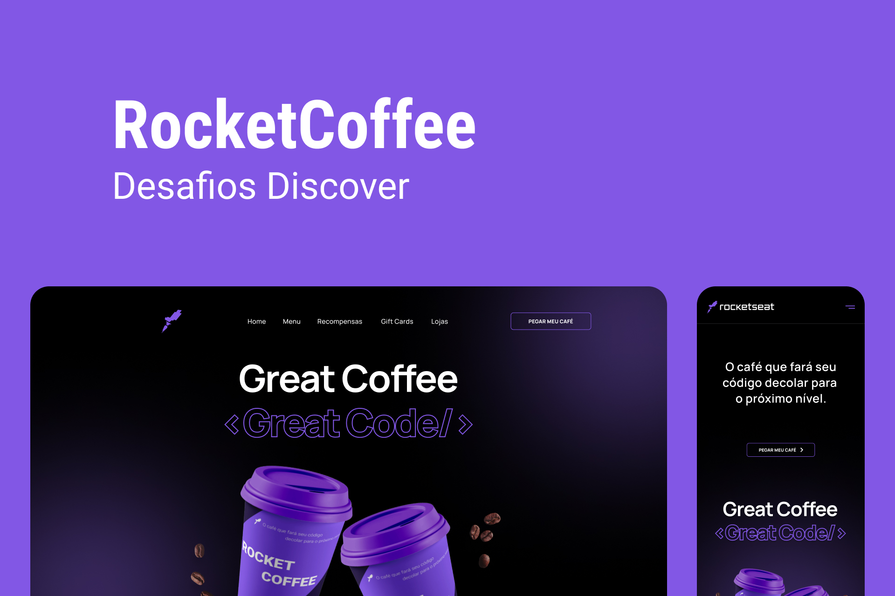

<h1 align="center"> Rocket coffee </h1>

  Desafio da Rocketseat, layout base no figma apenas.

  <a href="#-tecnologias">Tecnologias</a>&nbsp;&nbsp;&nbsp;|&nbsp;&nbsp;&nbsp;
  <a href="#-projeto">Projeto</a>&nbsp;&nbsp;&nbsp;|&nbsp;&nbsp;&nbsp;
  <a href="#-layout">Layout</a>&nbsp;&nbsp;&nbsp;|&nbsp;&nbsp;&nbsp;
  <a href="#memo-licença">Licença</a>

  

 

  

## 🚀 Tecnologias

Esse projeto foi desenvolvido com as seguintes tecnologias:

- Vite
- React JS
- TypeScript
- Tailwindcss
- Git e Github

## 💻 Projeto

Landing page de um site para pagar um café para o autor desenvolvedor de software.

## 🔖 Layout

Você pode visualizar o layout do projeto através [DESSE LINK](https://www.figma.com/file/J1Z33MISC22YZB8wfxiIns/NLW-Copa-Explorer/duplicate). É necessário ter conta no [Figma](https://figma.com) para acessá-lo.

## :memo: Licença

Esse projeto está sob a licença MIT.

---

Projeto proposto pela Rocketseat como desafio na plataforma  
Feito com ♥ by Matheus Ramalho :wave: [matheusramalho.dev](matheusramalho.dev)
